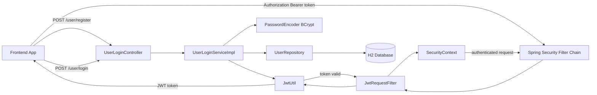
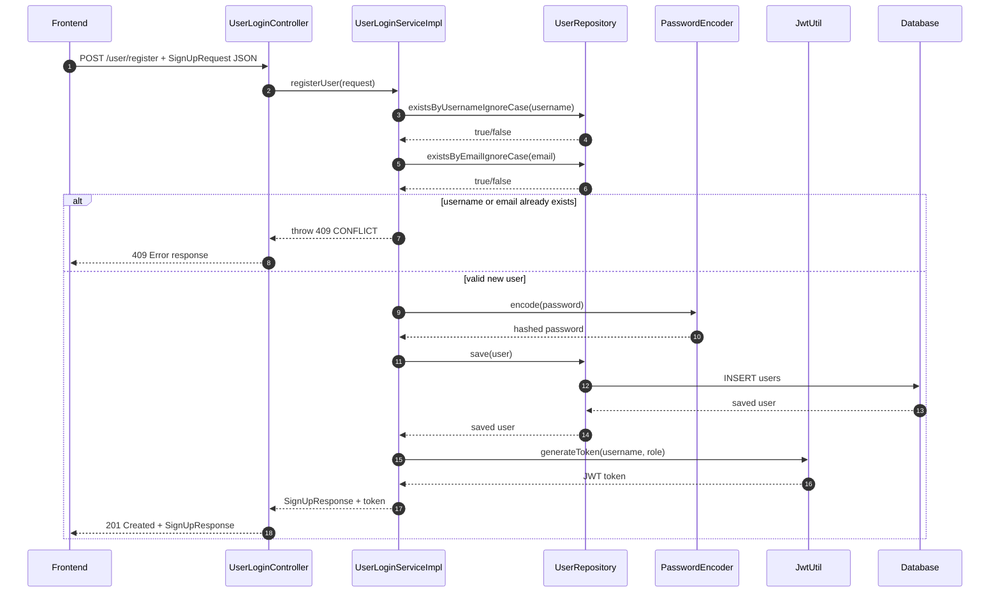
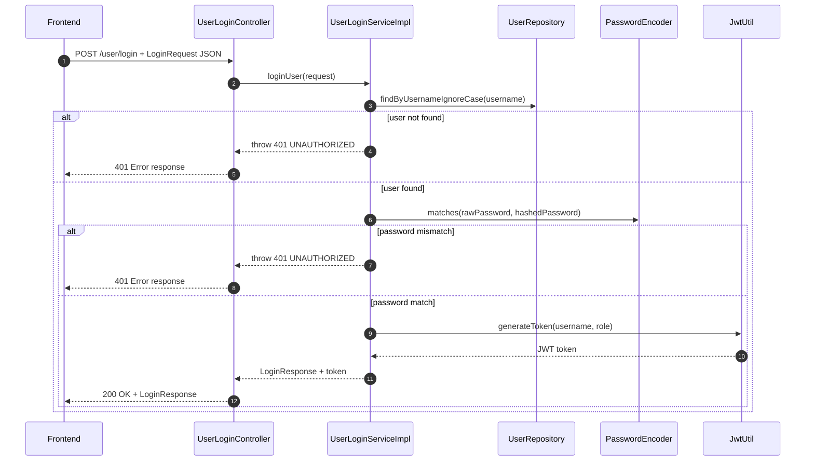
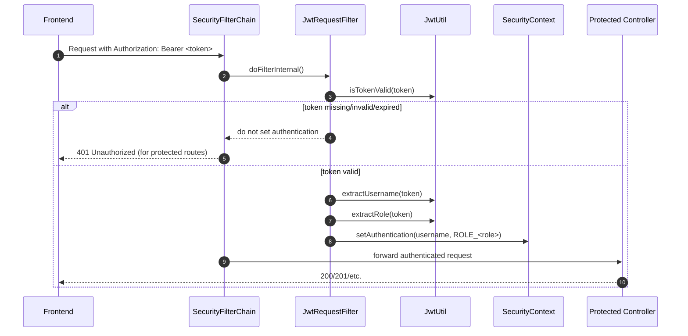
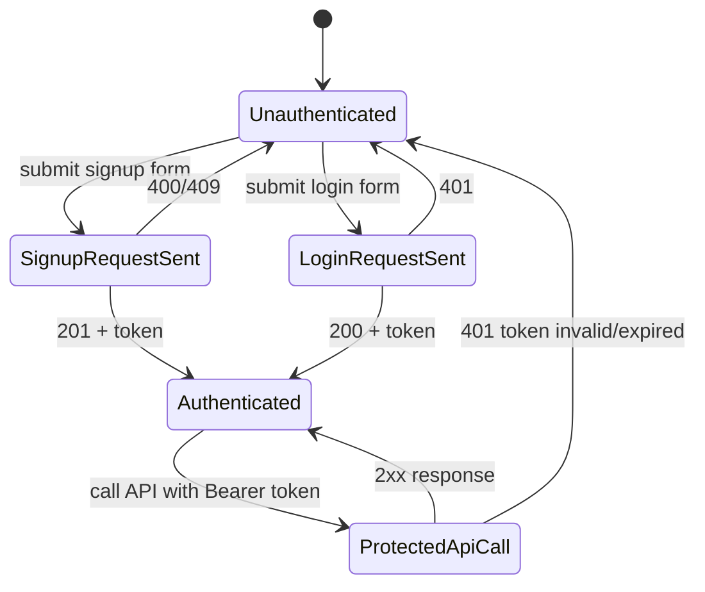

# Signup and Login with JWT - Complete Flow Guide

This document explains the full signup and login process in your current IPL backend and shows how a frontend should call it end-to-end.

## 1) Current Auth Setup (in this project)

- Base URL: http://localhost:8080
- Public endpoints:
  - POST /user/register
  - POST /user/login
- JWT token expiry: 86400000 ms (24 hours)
- Security mode: stateless (no server session)
- Password hashing: BCrypt

## 2) Visual Architecture Flow



## 3) File Flow Map (What each file does)

| Layer             | File                                                                        | Responsibility                                               |
| ----------------- | --------------------------------------------------------------------------- | ------------------------------------------------------------ |
| Controller        | src/main/java/com/ipl/backend/controller/UserLoginController.java           | Exposes /user/register and /user/login endpoints             |
| DTO               | src/main/java/com/ipl/backend/dto/SignUpRequest.java                        | Validates signup input (fullName, username, password, email) |
| DTO               | src/main/java/com/ipl/backend/dto/LoginRequest.java                         | Validates login input (username, password)                   |
| DTO               | src/main/java/com/ipl/backend/dto/SignUpResponse.java                       | Signup success payload with JWT                              |
| DTO               | src/main/java/com/ipl/backend/dto/LoginResponse.java                        | Login success payload with JWT                               |
| Service Interface | src/main/java/com/ipl/backend/service/UserLoginService.java                 | Defines registerUser and loginUser                           |
| Service Impl      | src/main/java/com/ipl/backend/service/serviceimpl/UserLoginServiceImpl.java | Business logic: checks user, hashes password, creates token  |
| Repository        | src/main/java/com/ipl/backend/repository/UserRepository.java                | DB queries for username/email existence and fetch            |
| Entity            | src/main/java/com/ipl/backend/entity/User.java                              | users table mapping and role defaults                        |
| JWT Utility       | src/main/java/com/ipl/backend/jwt/JwtUtil.java                              | Generates and validates JWT                                  |
| JWT Filter        | src/main/java/com/ipl/backend/jwt/JwtRequestFilter.java                     | Reads Bearer token and sets authentication                   |
| Security Config   | src/main/java/com/ipl/backend/security/SecurityConfig.java                  | Permits login/signup and protects all other routes           |
| Password Config   | src/main/java/com/ipl/backend/security/Configurations.java                  | Provides BCrypt PasswordEncoder bean                         |
| App Config        | src/main/resources/application.properties                                   | Stores jwt.secret and jwt.expiration-ms                      |

## 4) Signup Request Flow (Frontend to DB and back)



## 5) Login Request Flow (Frontend to token)



## 6) JWT Validation Flow for Protected APIs



## 7) Frontend Request Examples

### A) Signup

Request

- Method: POST
- URL: /user/register
- Headers: Content-Type: application/json
- Body:

```json
{
  "fullName": "Virat Kohli",
  "username": "virat18",
  "password": "myStrongPass123",
  "email": "virat@example.com"
}
```

Success response (201)

```json
{
  "message": "Signup successful",
  "userId": 1,
  "fullName": "Virat Kohli",
  "username": "virat18",
  "email": "virat@example.com",
  "role": "USER",
  "token": "<jwt-token>"
}
```

### B) Login

Request

- Method: POST
- URL: /user/login
- Headers: Content-Type: application/json
- Body:

```json
{
  "username": "virat18",
  "password": "myStrongPass123"
}
```

Success response (200)

```json
{
  "message": "Login successful",
  "userId": 1,
  "username": "virat18",
  "email": "virat@example.com",
  "role": "USER",
  "token": "<jwt-token>"
}
```

### C) Call protected API using token

Request headers:

```http
Authorization: Bearer <jwt-token>
```

## 8) Error Paths You Should Handle in Frontend

- 400 Bad Request
  - Bean validation failed (@Valid on request DTO).
  - Example: missing username, short password, invalid email.
- 409 Conflict
  - Username already exists.
  - Email already exists.
- 401 Unauthorized
  - Invalid username/password on login.
  - Missing/invalid/expired token for protected APIs.

Note: There is no custom global exception handler currently, so error response format is Spring default unless you add @ControllerAdvice.

## 9) Token Lifecycle

- Token created at signup and login.
- Claims include:
  - sub = username
  - role = USER or ADMIN
- Expiration = now + jwt.expiration-ms (currently 24h).
- Token is validated by JwtRequestFilter on each protected request.

## 10) Proper Production-Grade Improvements (Recommended)

- Add refresh token flow:
  - POST /user/refresh for short-lived access tokens.
- Add logout strategy:
  - Token blacklist or rotating refresh tokens.
- Add centralized exception format:
  - Use @ControllerAdvice for consistent error JSON.
- Restrict routes by role:
  - Use method security or route-based role checks.
- Store token securely in frontend:
  - Prefer HttpOnly secure cookies for web apps (to reduce XSS risk).

## 11) Complete Frontend-to-Backend Request Flow (Practical)



Frontend integration pattern (JavaScript)

```javascript
const API_BASE = "http://localhost:8080";

function saveToken(token) {
  localStorage.setItem("accessToken", token);
}

function getToken() {
  return localStorage.getItem("accessToken");
}

async function signup(payload) {
  const res = await fetch(`${API_BASE}/user/register`, {
    method: "POST",
    headers: { "Content-Type": "application/json" },
    body: JSON.stringify(payload),
  });

  const data = await res.json();
  if (!res.ok) throw data;

  saveToken(data.token);
  return data;
}

async function login(payload) {
  const res = await fetch(`${API_BASE}/user/login`, {
    method: "POST",
    headers: { "Content-Type": "application/json" },
    body: JSON.stringify(payload),
  });

  const data = await res.json();
  if (!res.ok) throw data;

  saveToken(data.token);
  return data;
}

async function callProtected(url, options = {}) {
  const token = getToken();
  const res = await fetch(`${API_BASE}${url}`, {
    ...options,
    headers: {
      "Content-Type": "application/json",
      Authorization: `Bearer ${token}`,
      ...(options.headers || {}),
    },
  });

  if (res.status === 401) {
    localStorage.removeItem("accessToken");
    throw new Error("Session expired. Please login again.");
  }

  return res;
}
```

Note: In your current backend, only signup and login endpoints are implemented in controllers; other controller files are placeholders right now.

---

This guide matches your current code and can be used directly for frontend integration and auth debugging.
